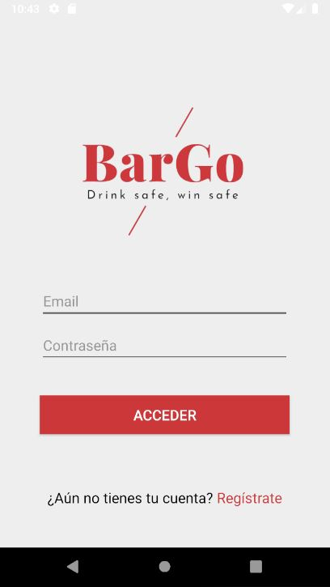
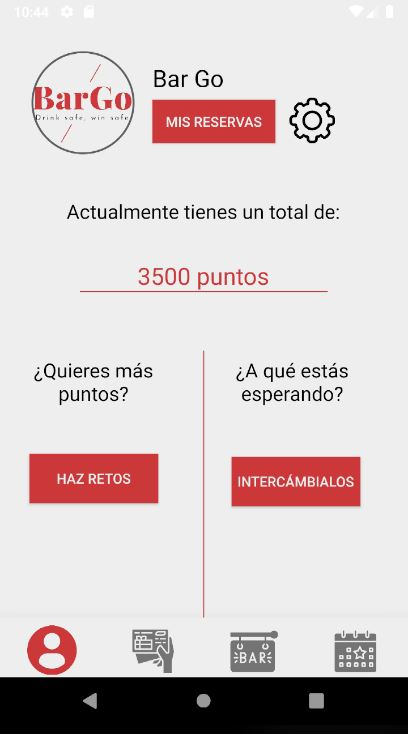
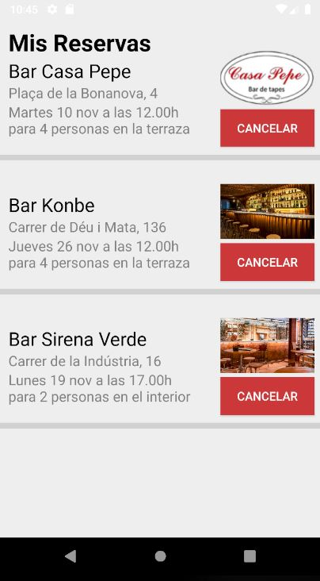
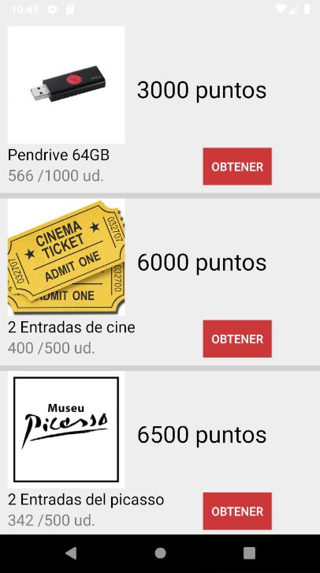
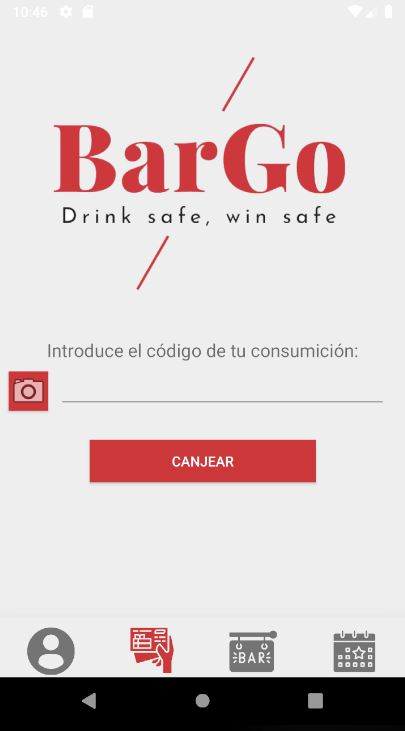
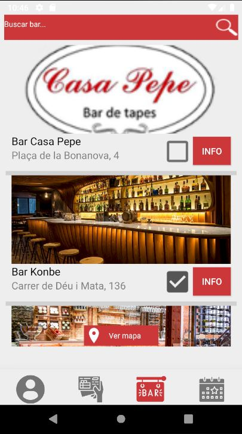
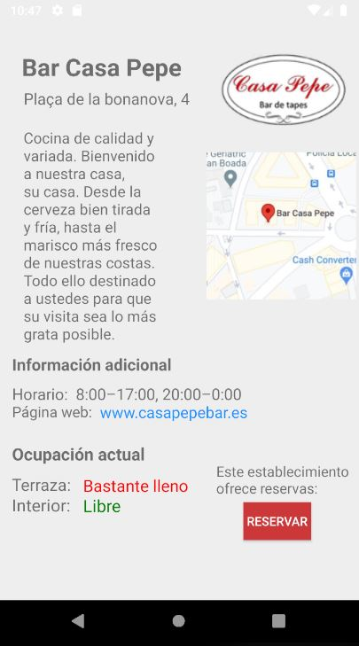
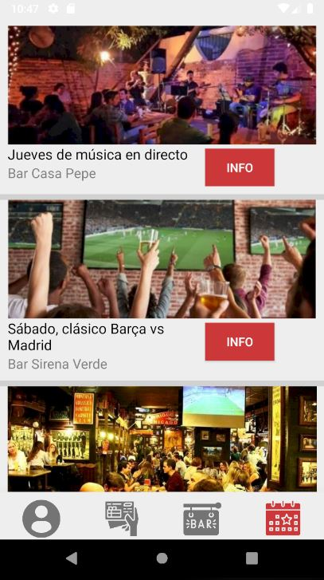
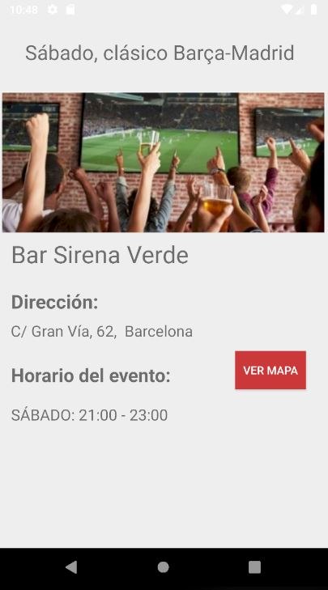

# PAE-FIB

Repositorio para la asignatura de PAE, FIB. El objetivo de la asignatura era trabajar en un proyecto multidisciplinar partiendo de un reto definido por una empresa, en nuestro caso, la empresa DAMM. 

DAMM nos propusó el siguiente reto: 

**¿Qué podemos hacer para atraer consumidores a los bares, garantizando las medidas sanitarias y de seguridad de la nueva normalidad (COVID-19)?**

Para hacer frente al reto propuesto, hemos creado una aplicación móvil llamada BarGo que permite lo siguiente:

1. Canjear códigos de productos para obtener puntos
2. Obtener premios mediante los puntos
3. Incentivar el consumo mediante retos
4. Conocer la ocupación del bar a tiempo real y hacer reservas
5. Informar de eventos especiales que se realicen en bares

## Capturas de la aplicación: 

